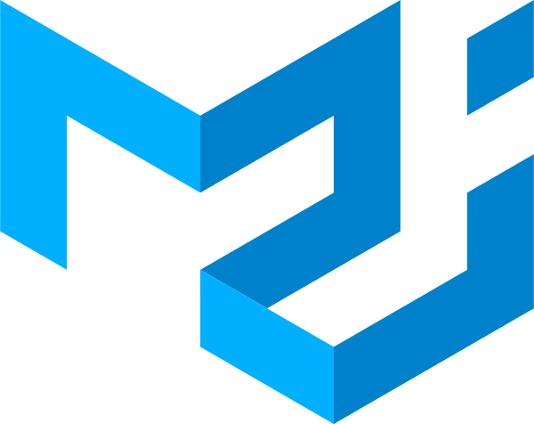
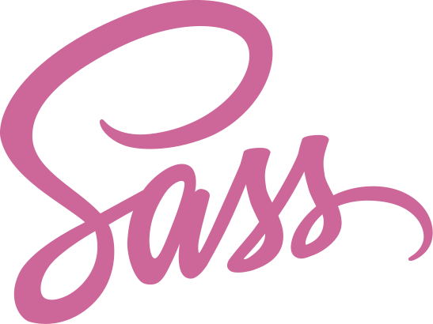
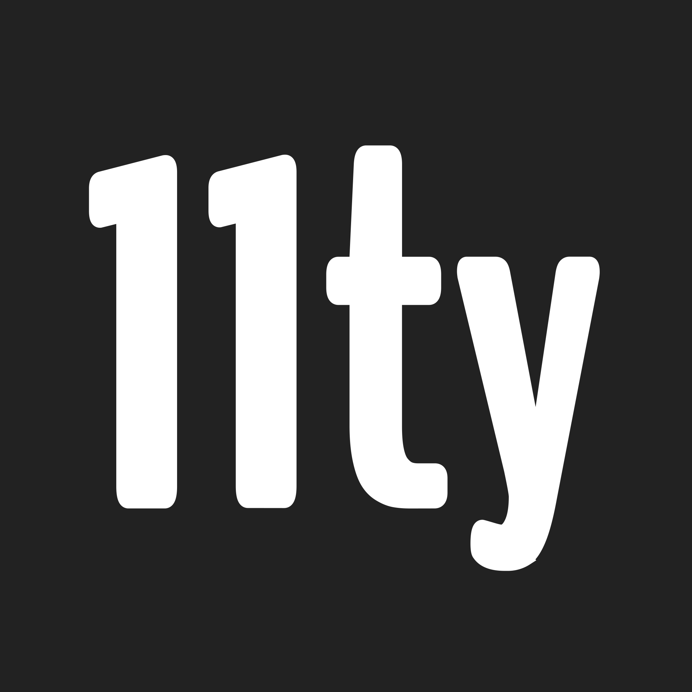

## I'm [searching](https://www.linkedin.com/in/jamesmitofsky/) for work 🕵️‍♂️

👨‍💻 Experienced with `React.js`  
🚀 Interested in the no-hydration framework, [`Qwik`](https://qwik.builder.io/)  
🤝 I really like helping local businesses, artists, and ideas.  

### My Languages & Tools

  
<h6>🇫🇷 Clickez ici pour le français 👈</h6>

👨‍💻 J'aime faire des choses avec React, et je me concentre sur l'expérience de l'utilisateur. Récemment, j'ai fini de lire "The Design of Everyday Things" par Don Norman, et je l'ai trouvé impressionnant.

📚 J'adore apprendre, donc quoique mon niveau en français reste un peu en bas, je suis chaud pour surmonter tous des obstacles. Maintenant, les obstacles sont plus comme, "comment on commande une baguette" mais j'espère que je vais y arriver.

🗺 Je suis arrivé des États-Unis à Caen, en Normandie, en janvier, et je suis immédiatement tombé amoureux du mode de vie ici. Je compte donc rester en France en permenance. :)
  
<a href="mailto: me@jamesmit.dev?subject=Parlons de la programmation!">Contactez-moi si vous voulez parler en plus!</a>

<!--More comprehensive tracking provided by Y HYPE-->

